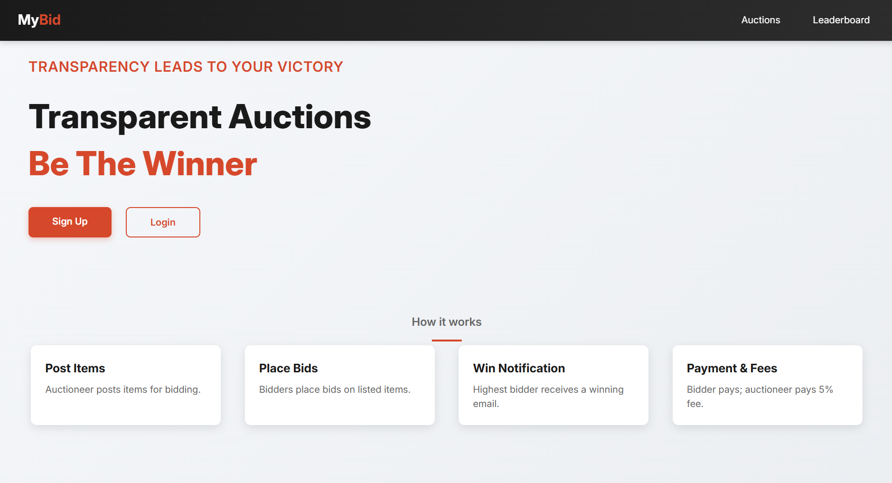
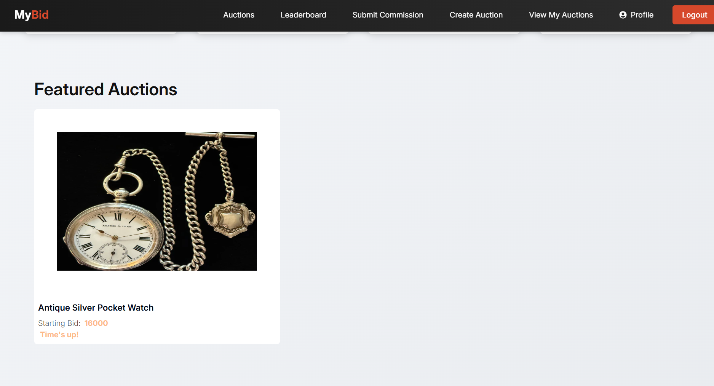
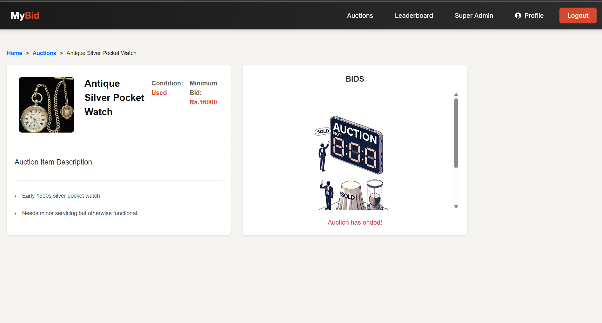
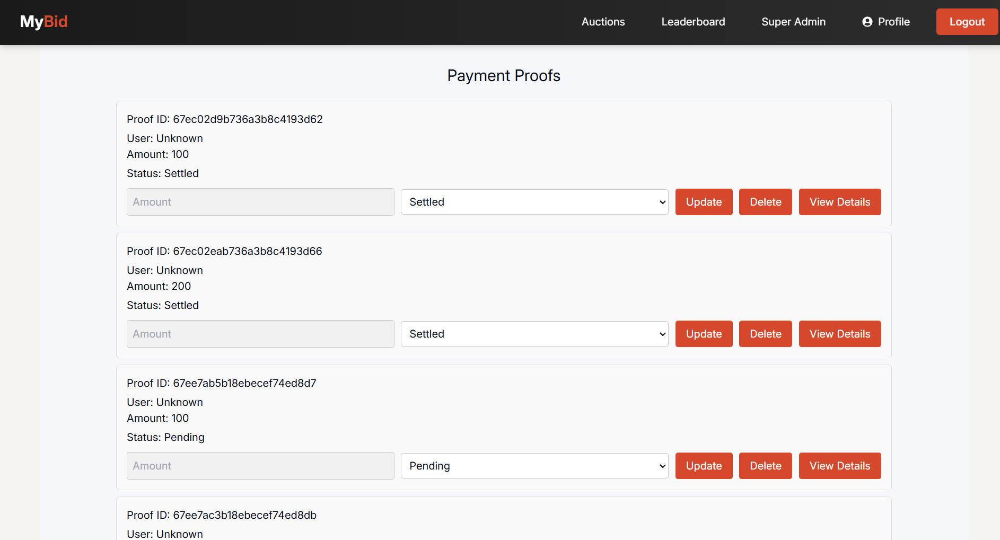

# Auction Platform

An online auction platform where users can register, list items for auction, upload images for listings, and place bids in real-time.

---

## Features

- User Authentication: Secure login and registration with hashed passwords.
- Auction Listings: Create and view detailed auction listings.
- Real-Time Bidding: Place bids with live updates via WebSocket.
- Countdown Timer: Track auction end times dynamically.
- Responsive UI: Optimized for desktop and mobile devices.
- Image Upload: Add images to auction listings (JPEG/PNG, max 5MB).
- Admin Dashboard: Manage auctions and monitor platform activity.

---

## Screenshots


### Home Page

### Auction Listing

### Bidding Interface

### Admin Panel

---

## Tech Stack

### Frontend

- React
- Vite
- JavaScript
- CSS

### Backend

- Node.js
- Express
- MongoDB
- Cloudinary (for image uploads)


### Access the Platform
- Open your browser and go to:
- https://mybid-auction.netlify.app

## Demo Login Credentials

# Auctioner
-Email: Ironman@gmail.com
-Password: Ironman@gmail.com

# Bidder
-Email: mohram@gmail.com
-Password: mohram@gmail.com

# SuperAdmin
-Email: mufasa@gmail.com
-Password: mufasa@gmail.com

---

## Installation

### 1. Clone the Repository

```bash


git clone https://github.com/Tejaskhope21/Auction-Platform.git
cd Auction-Platform

2. Install Frontend Dependencies

cd frontend
npm install


3. Install Backend Dependencies
cd ../backend
npm install


4. Configure Environment Variables
Create a .env file in the backend directory with the following:
env
MONGO_URI=your_mongodb_connection_string
JWT_SECRET=your_jwt_secret_key
CLOUDINARY_CLOUD_NAME=your_cloudinary_cloud_name
CLOUDINARY_API_KEY=your_cloudinary_api_key
CLOUDINARY_API_SECRET=your_cloudinary_api_secret
PORT=5000
Replace your_mongodb_connection_string with your MongoDB URI.

Generate a strong JWT_SECRET (at least 32 characters).

Sign up at Cloudinary and use your account credentials.

5. Start MongoDB
Make sure MongoDB is running locally or use MongoDB Atlas.

6. Run the Application
Backend
cd backend
npm start
Frontend

cd ../frontend
npm run dev
Access the Platform
Visit: http://localhost:3000

You can register, log in, create auctions with images, and bid in real-time.

Image Upload Configuration
Supported Formats: JPEG, PNG

Max Size: 5MB per image

Process:

Use the "Upload Image" button in the auction creation form.

Images are uploaded to Cloudinary and stored with secure URLs.

Cloudinary credentials must be correctly set in the .env file.

Credentials Management
User passwords are hashed using bcrypt before being stored in MongoDB.

Admin Access: Manually set role: 'admin' in a user's MongoDB document.

Environment variables (Mongo URI, JWT secret, Cloudinary keys) must be stored in .env and not committed to version control.

Security Tips:

Use a strong JWT secret.

Rotate Cloudinary API keys periodically.

Use HTTPS in production environments.

 Contributing
Fork the repository.

Create a new branch:
git checkout -b feature/your-feature

Make your changes and commit:
git commit -m "Add your feature"

Push to your branch:
git push origin feature/your-feature

Open a pull request.
